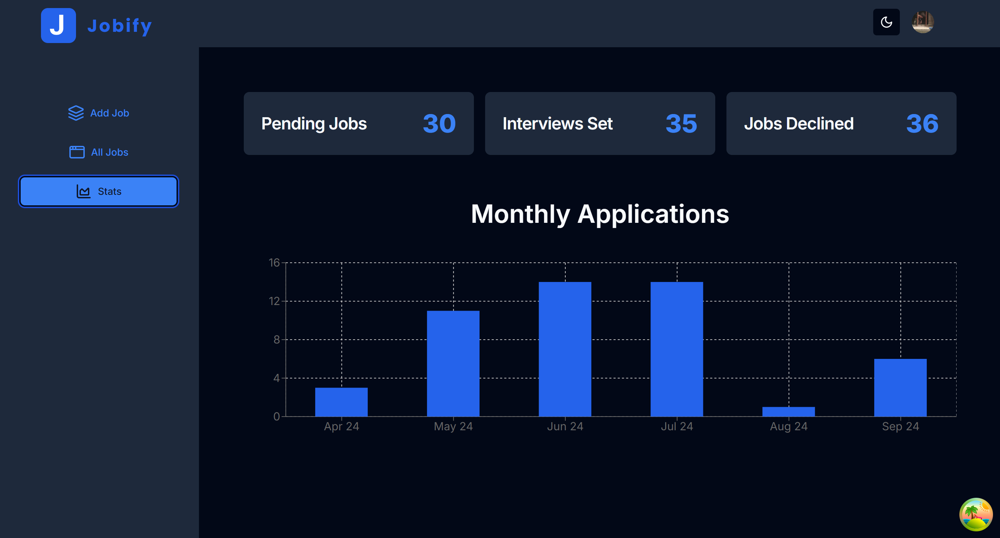

# My Jobify Next.js

**Disclaimer**: This project is based on the [Complete React, Next.js & TypeScript Projects Course 2024](https://www.udemy.com/course/react-tutorial-and-projects-course) John Smilga's course (section "Next.js - Jobify Project"). The primary purpose of this repository is for personal learning and practice. All credit for the original design and concepts goes to John Smilga. This repository serves as my implementation of the project following the course.

## Overview
Welcome to My Jobify App! You can track your job applications, view stats, and manage your profile easily with this app. Explore the app with sample data before signing up. Perfect for staying organized in your job search.

## Technologies Used
- React
- Next.js
- Tailwind CSS
- React query
- Prisma
- Zod

## How to Run the Project
1. Install the packages
```
npm install
```
2. Run the application
```
npm run dev
```

### Usage

- **Home page**
<br />The landing page of My Jobify, where users can register or log in. Demo users can explore the app without registration, experiencing the core features with generated sample data.


- **Sign in / Sign up**
<br />After clicking "Get Started" on the home page, users are directed to this page where they can log in via Google or email, or sign up for a new account. It's powered by Clerk, ensuring a smooth and secure authentication process.


- **Add Job Page**
<br />On this page, users can add new job applications by entering details such as position, company, location, job status, and job type. It provides an intuitive interface for organizing job application details.


- **All Jobs Page**
<br />This page displays a list of all added job applications, which can be sorted by various criteria. Users can edit or delete jobs, except for demo users, who can only view the data. The interface is clean and easy to navigate.


- **Stats Page**
<br />This page displays job application data in visually appealing charts and diagrams. Users can see job status breakdowns (e.g., pending, interviews, declined) and track the number of applications submitted over the last six months with area and bar charts.

